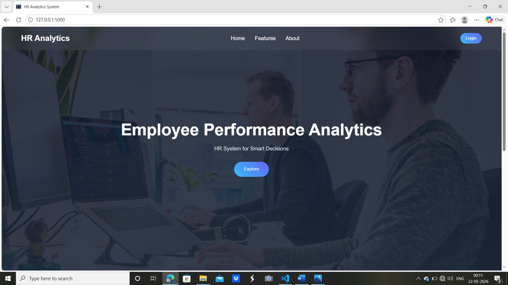
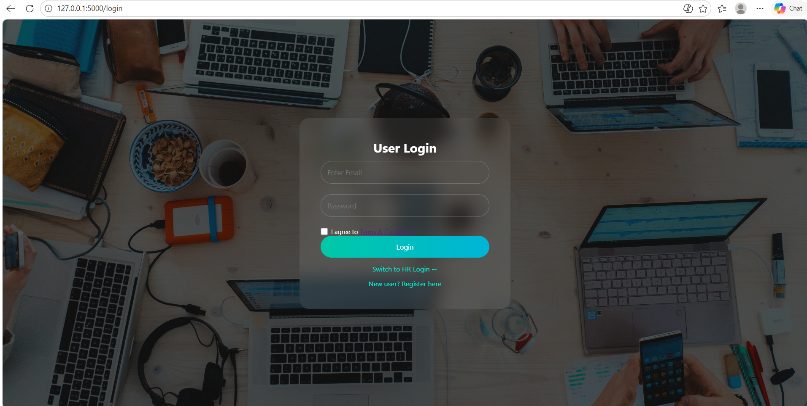
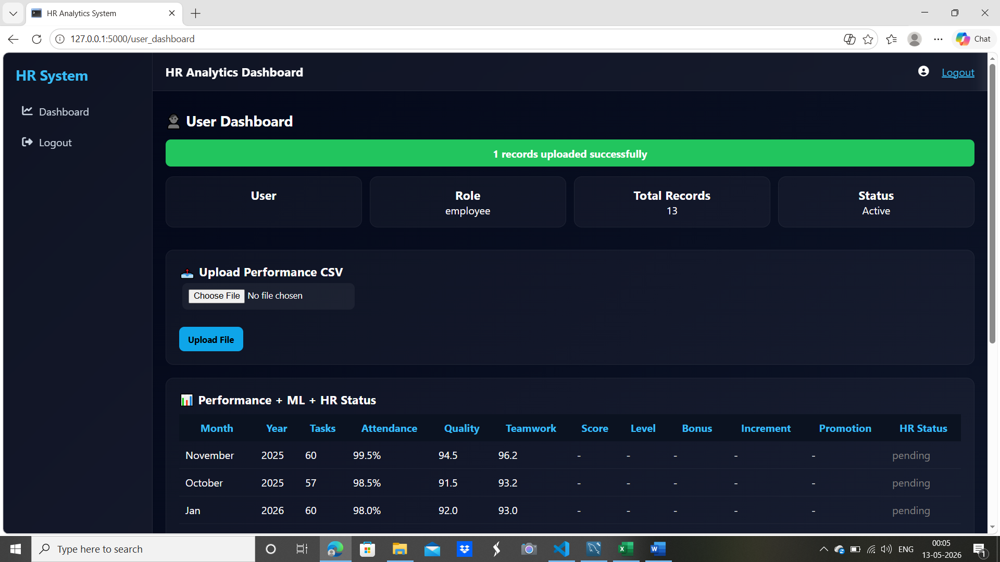
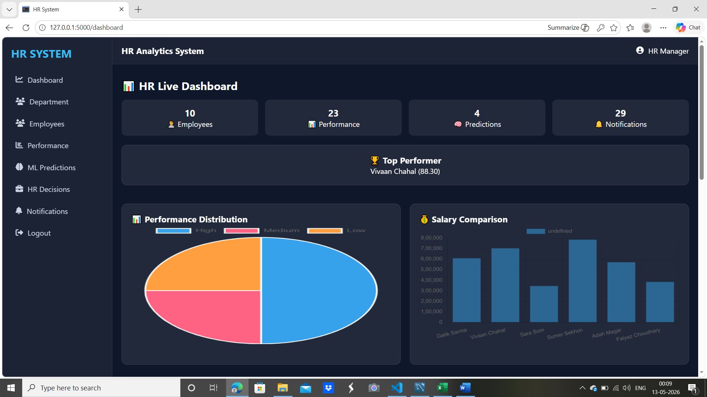
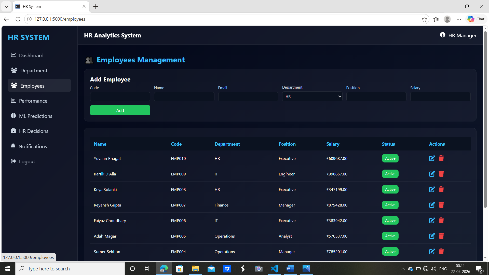
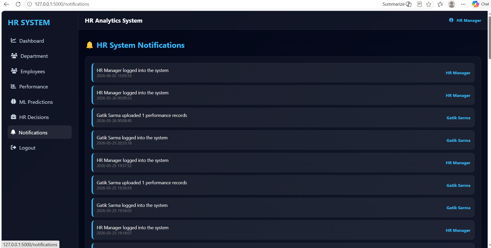
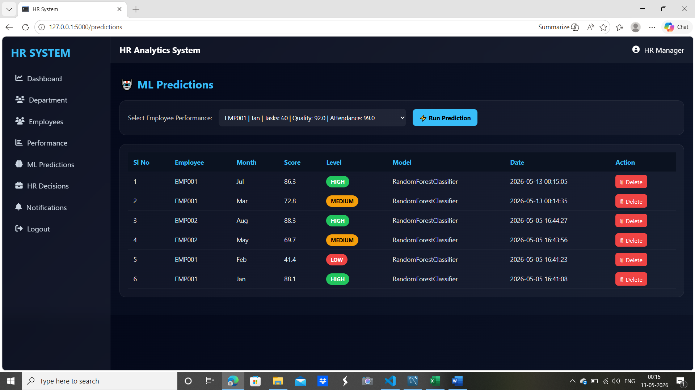
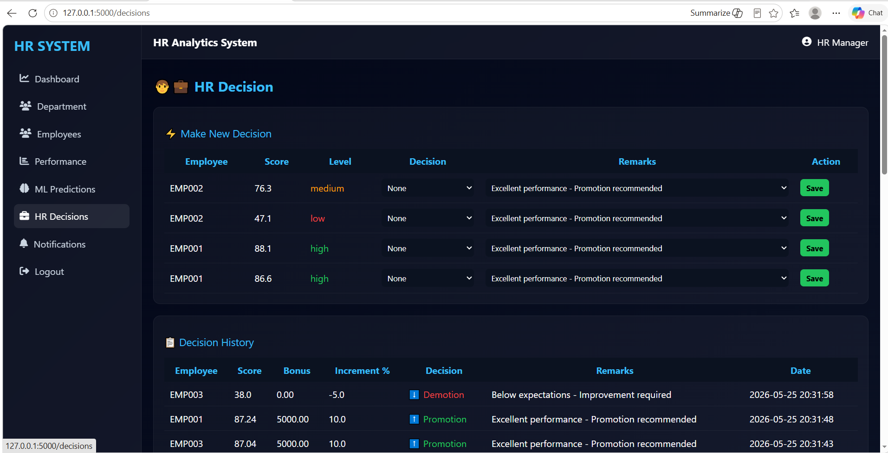

# Employee Performance Analysis and Productivity Prediction System

## Overview

The **Employee Performance Analysis and Productivity Prediction System** is a machine learning–based web application designed to help organizations evaluate employee performance and predict productivity levels using data-driven techniques.

Built with **Python, Flask, MySQL, and Scikit-learn**, the system analyzes employee performance metrics, predicts productivity categories, and assists HR teams with informed decision-making through interactive dashboards and automated recommendations.

## Features

* 🔐 Secure user authentication with role-based access
* 👥 Separate dashboards for HR managers and employees
* 📂 CSV upload for employee performance records
* 🤖 Machine learning–based productivity prediction using Random Forest
* 📊 Performance analysis and visualization
* 📈 Weighted performance score calculation
* 💼 Automated HR decision support (promotion, salary increment, or performance review recommendations)
* 🗄️ MySQL database integration for persistent storage
* 🔔 Activity notifications and performance tracking

## Tech Stack

* **Backend:** Python, Flask
* **Frontend:** HTML, CSS, JavaScript, Bootstrap
* **Database:** MySQL
* **Machine Learning:** Scikit-learn (Random Forest Classifier)
* **Data Processing:** Pandas, NumPy
* **Visualization:** Chart.js

## Machine Learning Approach

The system evaluates employees using four primary metrics:

* Attendance Rate
* Tasks Completed
* Quality Score
* Teamwork Score

A weighted performance score is calculated and used to classify employees into productivity levels such as **High**, **Medium**, or **Low**. A trained **Random Forest Classifier** provides productivity predictions to support HR decision-making.

## Project Structure

```
├── app.py
├── model.py
├── database/
├── static/
├── templates/
├── uploads/
├── docs/
├── model.pkl
├── requirements.txt
└── README.md
```

## Installation

1. Clone the repository.
2. Install the required dependencies:

bash
pip install -r requirements.txt


3. Configure the MySQL database.
4. Run the Flask application:

bash
python app.py


5. Open the application in your browser.

## Use Cases

* Employee performance evaluation
* HR analytics and reporting
* Productivity prediction
* Data-driven promotion and appraisal support
* Academic demonstration of machine learning in HR systems

## Future Enhancements

* REST API integration
* Real-time analytics dashboards
* Mobile application support
* Enhanced security features
* Advanced ML model comparison and tuning

## Future Enhancements

* REST API integration
* Real-time analytics dashboards
* Mobile application support
* Enhanced security features
* Advanced ML model comparison and tuning

## 📸 Screenshots

### 🏠 Home Page


### 🔐 Login Page


### 👥 Employee Dashboard


### 📂 CSV Upload


### 🧑‍💼 HR Dashboard


### 📊 Employee List


### 🔔 Notifications Page


### 🤖 Prediction Page


### 💼 HR Decisions Page


## Academic Project

This project was developed as part of the **Bachelor of Computer Applications (BCA)** curriculum and demonstrates the integration of machine learning with web application development for human resource analytics.

## License

This project is intended for educational and learning purposes.
